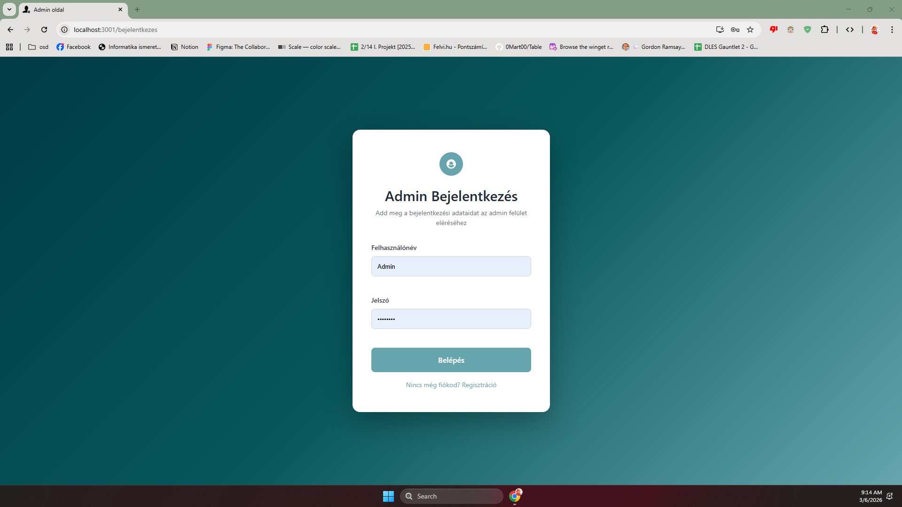
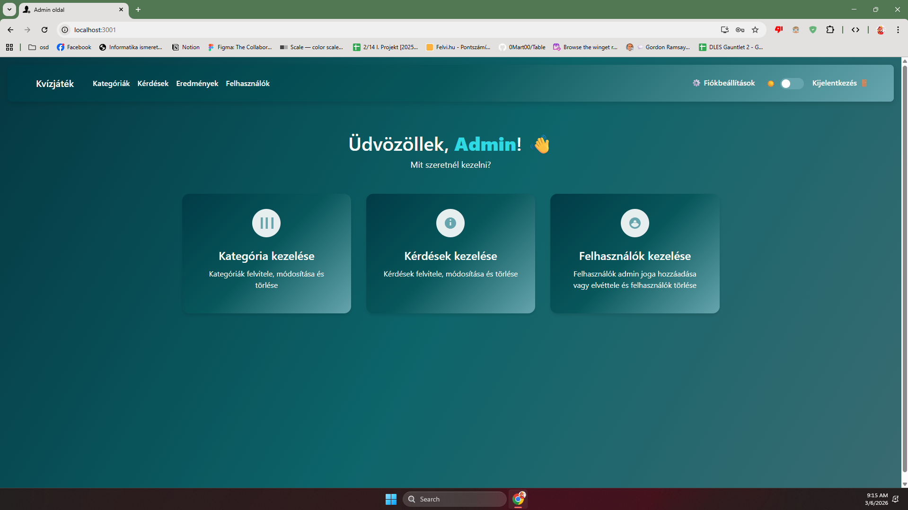
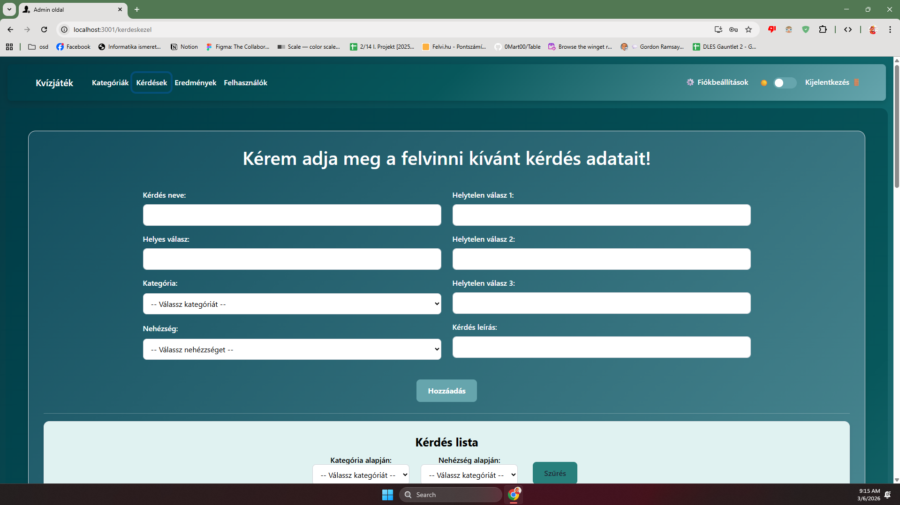
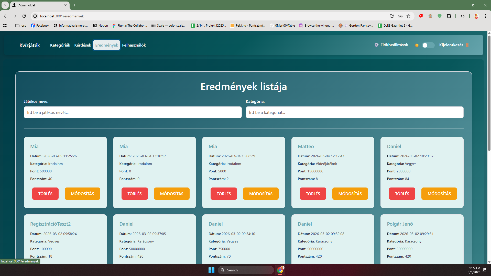

# Frontend Admin Alkalmazás

## Bevezetés
Ez a webes alkalmazás egy átfogó adminisztrációs felületet biztosít egy kvíz- vagy tesztkészítő rendszer számára. A projekt célja, hogy lehetővé tegye a kérdések, kategóriák és felhasználók hatékony kezelését, valamint a kitöltött tesztek eredményeinek nyomon követését. A felület modern, reszponzív kialakítású, amely könnyen használható asztali és mobil eszközökön egyaránt. A rendszer differenciált hozzáférést biztosít adminisztrátorok és regisztrált felhasználók számára, így mindenki csak a számára releváns funkciókat éri el.

## Készítők
- Harkai Dániel
- Daróczi Gergő


## Fő Funkciók

### Nem bejelentkezett felhasználók számára
- **Bejelentkezés:** Biztonságos belépés felhasználónév és jelszó megadásával.
- **Regisztráció:** Új felhasználói fiók létrehozása (amennyiben engedélyezett).

### Bejelentkezett felhasználók számára
- **Felhasználói Menü:** Hozzáférés a saját profilhoz és alapvető funkciókhoz.
- **Profil szerkesztése:** Jelszóváltoztatás és egyéb személyes beállítások módosítása.
- **Téma váltása:** Világos és sötét mód (Dark Mode) közötti váltás.
- **Kijelentkezés:** Biztonságos kilépés a rendszerből.

### Adminisztrátorok számára
- **Kérdéskezelés:** Új kérdések feltöltése, meglévők szerkesztése és törlése. Szűrés kategóriák és nehézségi szintek szerint.
- **Kategóriakezelés:** Új kategóriák létrehozása, szerkesztése és törlése.
- **Felhasználókezelés:** Felhasználók listázása, admin jogosultságok kezelése (jog adása/elvétele), felhasználók törlése.
- **Eredmények megtekintése:** A felhasználók által kitöltött tesztek eredményeinek részletes áttekintése és kezelése.
- **Admin Főmenü:** Központi navigáció az összes adminisztrátori funkcióhoz.

## Architektúra

A projekt modern webfejlesztési technológiákra épül:

- **Frontend:** React (v19) - Komponens alapú felépítés, React Router DOM (v7) a navigációhoz, Bootstrap 5 a stílusozáshoz.
- **Backend:** Express.js (Node.js) - REST API végpontok kiszolgálása.
- **Adatbázis:** MySQL - Relációs adatbázis az adatok tárolására.

## Telepítés és Futtatás

A projekt futtatásához szükséges a Node.js és az npm telepítése.


1.  **Függőségek telepítése:**
    Lépj be a frontend könyvtárba, és futtasd a következő parancsot:
    ```bash
    npm install
    ```

2.  **Fejlesztői szerver indítása:**
    ```bash
    npm start
    ```
    Az alkalmazás alapértelmezetten a [http://localhost:3000](http://localhost:3000) címen érhető el.

## Adatbázis Szerkezet

*(Ide illeszd be a phpMyAdmin-ból kimásolt adatbázis sémát vagy képet)*


## Képernyőképek az oldal működéséről

### Bejelentkezés


### Admin Főmenü


### Kérdések Kezelése


### Eredmények Listája


## API Végpontok

A frontend az alábbi végpontokon kommunikál a szerverrel:

| Funkció | Metódus | Végpont | Leírás |
| :--- | :--- | :--- | :--- |
| **Auth** | POST | `/admin/bejelentkezes` | Admin bejelentkezés |
| **Auth** | GET | `/admin/check-admin/:user` | Admin jogosultság ellenőrzése |
| **Auth** | POST | `/admin/regisztracio` | Adminisztrátor regisztráció |
| **User** | GET | `/admin/jatekoslista` | Felhasználók lekérdezése |
| **User** | PUT | `/admin/jog-ad/:id` | Admin jog adása |
| **User** | PUT | `/admin/jog-elvesz/:id` | Admin jog elvétele |
| **User** | DELETE | `/admin/jatekostorles/:id` | Felhasználó törlése |
| **User** | DELETE | `/admin/sajat-fiok-torles/:user` | Saját fiók törlése |
| **User** | PUT | `/admin/jelszo-modositas` | Jelszó módosítása |
| **Questions** | GET | `/kerdes` | Kérdések lekérdezése |
| **Questions** | POST | `/kerdesFeltoltes` | Új kérdés feltöltése |
| **Questions** | PUT | `/kerdesModositasa/:id` | Kérdés módosítása |
| **Questions** | DELETE | `/kerdesTorles/:id` | Kérdés törlése |
| **Questions** | GET | `/kerdesekkeres` | Kérdések keresése |
| **Category** | GET | `/kategoria` | Kategóriák lekérdezése |
| **Category** | GET | `/kategoriaadmin` | Kategóriák admin nézete |
| **Category** | POST | `/kategoriaFeltoltes` | Kategória feltöltése |
| **Category** | PUT | `/kategoriaModositasa/:id` | Kategória módosítása |
| **Category** | DELETE | `/kategoriaTorles/:id` | Kategória törlése |
| **Results** | GET | `/eredmenyekAdmin` | Eredmények lekérdezése |
| **Results** | DELETE | `/eredmenyTorlesAdmin/:id` | Eredmény törlése |
| **Results** | PUT | `/eredmenyModositasAdmin/:id` | Eredmény módosítása |
| **Misc** | GET | `/nehezseg` | Nehézségi szintek lekérdezése |

## Munkamegosztás

Az alábbi táblázat mutatja a projekt egyes részeinek felelőseit:

| Feladatkör | Felelős |
| :--- | :--- |
| **Frontend Design (CSS/Bootstrap)** | *(Név)* |
| **React Komponensek fejlesztése** | *(Név)* |
| **Backend API végpontok** | *(Név)* |
| **Adatbázis tervezés és megvalósítás** | *(Név)* |
| **Tesztelés és Dokumentáció** | *(Név)* |

## Szerzői Jog

Ez a projekt a saját szellemi termékünk, iskolai záródolgozat céljából készült.
