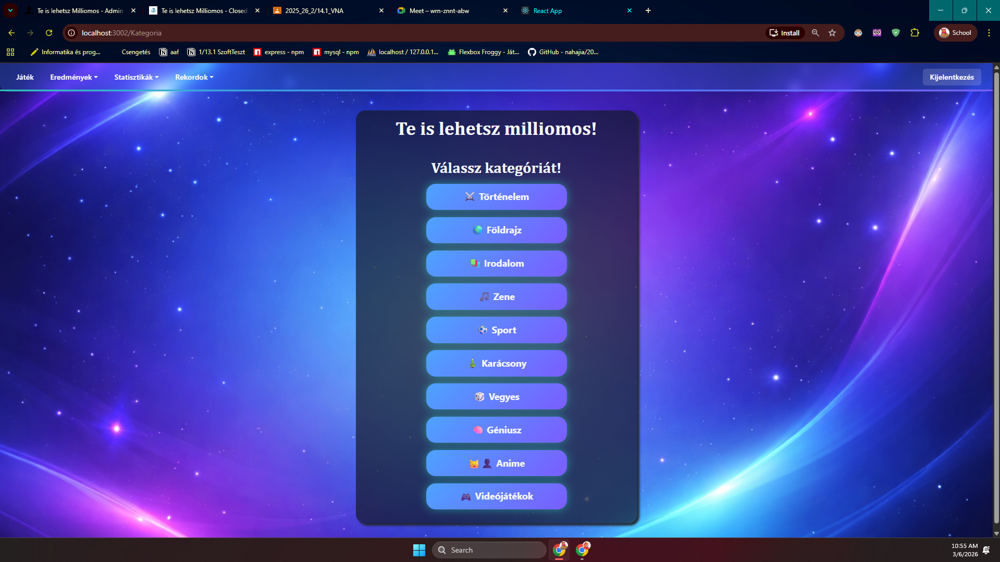
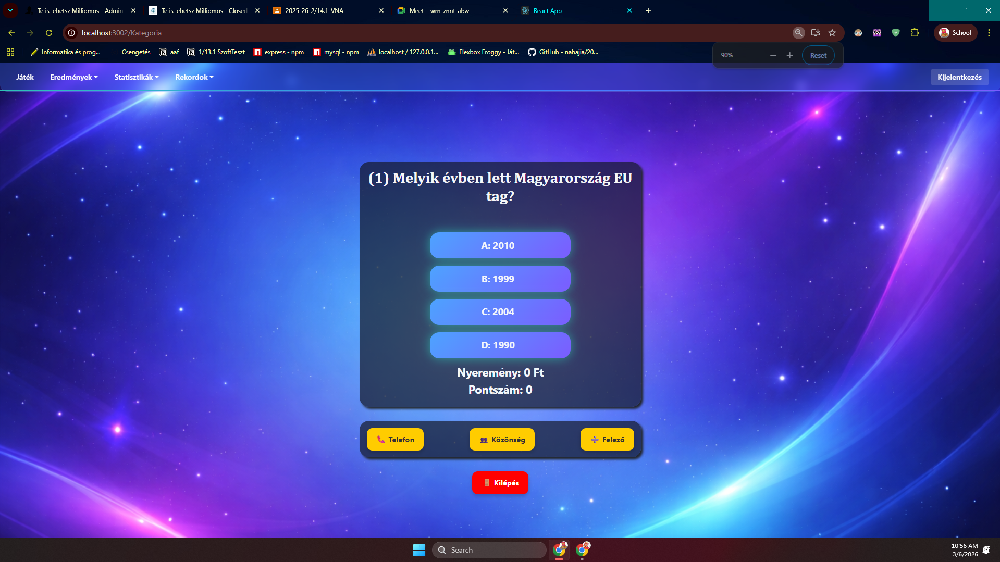
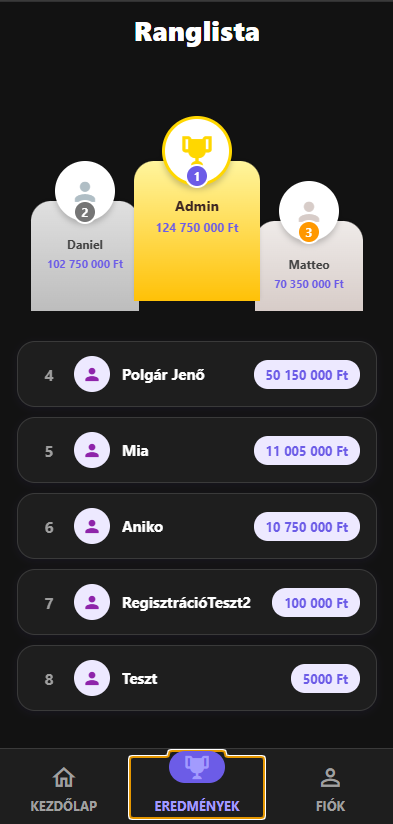

#Lehetsz Milliomos! – Kvíz Játék

---

## Bevezetés

A **„Te is lehetsz Milliomos!"** egy webes és mobilos kvíz alkalmazás, amely a közismert tévéshow hangulatát hozza el a felhasználók számára. A játék során a felhasználók különböző témakörök – például történelem, természettudomány, sport és kultúra – kérdéseire válaszolhatnak, miközben egyre nagyobb virtuális nyereményt gyűjthetnek össze. A kérdések nehézségi szintje fokozatosan nő: könnyű, közepes és nehéz kategóriák biztosítják, hogy mind a kezdők, mind a tapasztalt kvízjátékosok megtalálják a számukra megfelelő kihívást. Az alkalmazás ranglistán keresztül lehetővé teszi a játékosok összehasonlítását, a profil oldalon pedig mindenki nyomon követheti saját fejlődését, szintjét és korábbi eredményeit.

---

## Készítők

| Név | Szerep |
|---|---|
| **Dani** | Backend (játéklogika, eredmények, kérdések lekérése), React frontend |
| **Gergő** | Backend (admin panel, játékos kezelés, kategória/kérdés CRUD),React Native mobilapp ,React webes admin  |

---

## Fő funkciók

### Nem bejelentkezett felhasználó
- Kategóriák és játékmódok böngészése
- Ranglista megtekintése (top játékosok nyeremény alapján)
- Regisztráció

### Bejelentkezett felhasználó
- Kategória kiválasztása és kvíz indítása (könnyű / közepes / nehéz / vegyes)
- Segítségek használata (50/50, közönségszavazás, telefonos segítség)
- Eredmény mentése játék végén
- Profil megtekintése (szint, XP, nyeremény összesítő)
- Játékelőzmények és statisztikák megtekintése
- Jelszó módosítása, saját fiók törlése
- Sötét / Világos téma váltása

### Rendszergazda (Admin)
- Összes játékos listájának kezelése (szerep adása/elvétele, törlés)
- Kérdések hozzáadása, szerkesztése, törlése
- Kategóriák hozzáadása, szerkesztése, törlése
- Admin webes panel elérése

---

## Architektúra

```
┌─────────────────────┐     HTTP/JSON      ┌──────────────────────┐
│  React Native App   │ ◄────────────────► │  Express.js Backend  │ 
│  (Expo / Mobile)    │                    │ (Node.js, port 3000) │
└─────────────────────┘                    └──────────┬───────────┘
                                                      │ mysql
┌─────────────────────┐     HTTP/JSON                 ▼
│  React Web Admin    │ ◄────────────────► ┌──────────────────────┐
│  (Frontend Admin)   │                    │   MySQL Adatbázis    │
└─────────────────────┘                    │     (phpMyAdmin)     │
                                           └──────────────────────┘
```

| Réteg | Technológia |
|---|---|
| Mobilalkalmazás | React Native + Expo (TypeScript) |
| Webes admin felület | React |
| Backend API | Node.js + Express.js |
| Adatbázis | MySQL (phpMyAdmin) |
| Authentikáció | JWT (JSON Web Token) + bcrypt |

---

## Telepítés és futtatás

### Előfeltételek
- [Node.js](https://nodejs.org/) (LTS ajánlott)
- [XAMPP](https://www.apachefriends.org/) vagy MySQL szerver
- [Expo CLI](https://docs.expo.dev/get-started/installation/) (mobilapp esetén)
- [Git](https://git-scm.com/)

### 1. Repository klónozása

```bash
git clone https://github.com/felhasznalonev/zarodolgozat.git
cd zarodolgozat
```

### 2. Adatbázis beállítása

1. Indítsd el a MySQL szervert (pl. XAMPP-on keresztül)
2. phpMyAdminban hozz létre egy `zarodolgozat_kvizjatek` nevű adatbázist
3. Importáld a mellékelt SQL fájlt:

```bash
# phpMyAdminban: Importálás → fájl kiválasztása:
zarodolgozat_kvizjatek_create_database.sql
```

### 3. Backend indítása

```bash
cd backend
npm install
node Backend.js
```

A backend elérhető lesz: `http://localhost:3000`

### 4. React Native mobilapp indítása

```bash
cd "frontend Nativ"
npm install
npx expo start
```

Ezután Expo Go alkalmazással (Android/iOS) vagy emulátorral megnyitható.

### 5. Webes Admin felület indítása

```bash
cd "Frontend Admin"
npm install
npm start
```

---

## Adatbázis struktúra

> 📸 **Kép helye:** ide illesszétek be a phpMyAdmin táblák képernyőképét

<!-- Példa:  -->

### Táblák

| Tábla | Fontosabb mezők |
|---|---|
| `jatekos` | `jatekos_id`, `jatekos_nev`, `jatekos_jelszo` (bcrypt), `jatekos_admin` |
| `kategoria` | `kategoria_id`, `kategoria_nev` |
| `kerdesek` | `kerdesek_id`, `kerdesek_kerdes`, `kerdesek_helyesValasz`, `kerdesek_helytelenValasz1-3`, `kerdesek_kategoria`, `kerdesek_leiras`, `kerdesek_nehezseg` |
| `eredmenyek` | `Eredmenyek_id`, `Eredmenyek_jatekos`, `Eredmenyek_kategoria`, `Eredmenyek_pont`, `Eredmenyek_pontszam`, `Eredmenyek_datum` |

---

## Képernyőképek

> 📸 **Képek helye:** ide illesszétek be a képernyőképeket (pl. `./Githubkepek/` mappából)

| Képernyő | Leírás |
|---|---|
|  |Admin Bejelentkezési képernyő |
|  | Játékmód és kategória választó |
|  | Aktív kvíz kérdés segítségekkel |
|  | Globális nyeremény ranglista |
|  | Felhasználói profil, szint, XP sáv |
|  | Webes admin kezelőfelület |

---

## API végpontok

### Játéklogika – `Backend.js` (Dani)

| Metódus | Végpont | Leírás | Body / Params |
|---|---|---|---|
| `GET` | `/kategoria` | Kategóriák listája | – |
| `GET` | `/kategoriaadmin` | Kategóriák kérdésszámmal | – |
| `POST` | `/kerdesekKonnyu` | Könnyű kérdések kategória szerint | `{ kategoria }` |
| `POST` | `/kerdesekKozepes` | Közepes kérdések kategória szerint | `{ kategoria }` |
| `POST` | `/kerdesekNehez` | Nehéz kérdések kategória szerint | `{ kategoria }` |
| `GET` | `/kerdesekKonnyuVegyes` | Könnyű vegyes kategória kérdések | – |
| `GET` | `/kerdesekKozepesVegyes` | Közepes vegyes kategória kérdések | – |
| `GET` | `/kerdesekNehezVegyes` | Nehéz vegyes kategória kérdések | – |
| `GET` | `/nehezVegyes` | Nehéz vegyes (Géniusz mód) | – |
| `POST` | `/jatekos` | Játékos nevének lekérése ID alapján | `{ jatekosId }` |
| `POST` | `/eredmenyek` | Játékos eredményei | `{ jatekosId }` |
| `POST` | `/eredmenyekPontszam` | Játékos pontszámai | `{ jatekosId }` |
| `POST` | `/osszesNyeremeny` | Összes nyeremény összege | `{ jatekosId }` |
| `POST` | `/osszesPontszam` | Összes pontszám összege | `{ jatekosId }` |
| `POST` | `/eredmenyFelvitel` | Eredmény mentése játék után | `{ nyeremeny, pontszam, jatekos, kategoria }` |
| `DELETE` | `/eredmenyTorles/:id` | Eredmény törlése | `:eredmenyek_id` |
| `GET` | `/rekordok` | Nyeremény ranglista | – |
| `GET` | `/pontszamRekordok` | Pontszám ranglista | – |
| `POST` | `/eredmenyekNaponkent` | Napi nyeremény összesítő | `{ jatekosId }` |
| `POST` | `/pontszamokNaponkent` | Napi pontszám összesítő | `{ jatekosId }` |
| `POST` | `/eredmenyekKategoriankent` | Nyeremény kategóriánként | `{ jatekosId, kategoriaId }` |
| `POST` | `/pontszamokKategoriankent` | Pontszám kategóriánként | `{ jatekosId, kategoriaId }` |

---

### Authentikáció & Felhasználókezelés – `Admin.js` (Gergő)

| Metódus | Végpont | Leírás | Body / Params |
|---|---|---|---|
| `POST` | `/admin/bejelentkezes` | Bejelentkezés (JWT token) | `{ jatekos_nev, jatekos_jelszo }` |
| `POST` | `/admin/regisztracio` | Regisztráció | `{ jatekos_nev, jatekos_jelszo }` |
| `GET` | `/admin/check-admin/:nev` | Admin státusz lekérése | `:jatekos_nev` |
| `GET` | `/admin/jatekoslista` | Összes játékos listája | – |
| `PUT` | `/admin/jog-ad/:id` | Admin jog megadása | `:jatekos_id` |
| `PUT` | `/admin/jog-elvesz/:id` | Admin jog elvétele | `:jatekos_id` |
| `PUT` | `/admin/engedelykeres/:nev` | Admin jogosultság kérése | `{ jatekos_admin }` |
| `DELETE` | `/admin/jatekostorles/:id` | Játékos törlése | `:jatekos_id` |
| `PUT` | `/admin/jelszo-modositas` | Saját jelszó módosítása | `{ jatekos_nev, regi_jelszo, uj_jelszo }` |
| `DELETE` | `/admin/sajat-fiok-torles/:nev` | Saját fiók törlése | `:jatekos_nev` |

---

### Kérdés CRUD – `Kerdes.js` (Gergő)

| Metódus | Végpont | Leírás | Body / Params |
|---|---|---|---|
| `POST` | `/kerdesFeltoltes` | Új kérdés feltöltése | `{ kerdesek_kerdes, helyesValasz, helytelenValasz1-3, kategoria, leiras, nehezseg }` |
| `DELETE` | `/kerdesTorles/:id` | Kérdés törlése | `:kerdesek_id` |
| `PUT` | `/kerdesModositasa/:id` | Kérdés módosítása | `:kerdesek_id` + body |
| `GET` | `/kerdes` | Összes kérdés listája | – |

---

### Kategória CRUD – `Kategoria.js` (Gergő)

| Metódus | Végpont | Leírás | Body / Params |
|---|---|---|---|
| `POST` | `/kategoriaFeltoltes` | Új kategória hozzáadása | `{ kategoria_nev }` |
| `PUT` | `/kategoriaModositasa/:id` | Kategória szerkesztése | `:kategoria_id` + `{ kategoria_nev }` |
| `DELETE` | `/kategoriaTorles/:id` | Kategória törlése | `:kategoria_id` |

---

### Játékos CRUD – `Jatekos.js` (Gergő)

| Metódus | Végpont | Leírás | Body / Params |
|---|---|---|---|
| `GET` | `/jatekos` | Összes játékos | – |
| `POST` | `/jatekos` | Játékos hozzáadása | `{ jatekos_nev }` |

---

## Munkamegosztás összefoglalás

| Terület | Dani | Gergő |
|---|---|---|
| Backend – játéklogika, kérdések, eredmények | ✅ | |
| Backend – admin, auth (JWT/bcrypt), CRUD | | ✅ |
| React Native mobilalkalmazás | ✅ | |
| React webes admin panel | | ✅ |
| Adatbázis tervezés | ✅ | ✅ |


> Ez a szoftver kizárólagosan a szerzők saját szellemi terméke, minden jog fenntartva.
